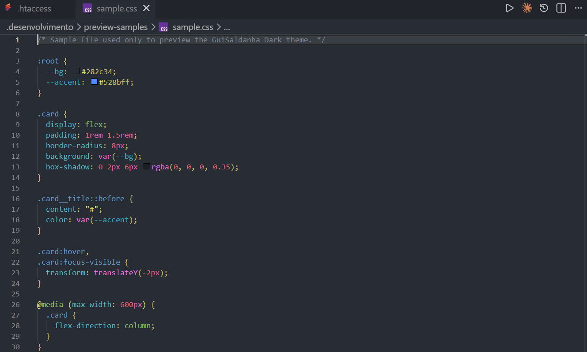

# GuiSaldanha Dark

[](https://marketplace.visualstudio.com/items?itemName=guisaldanha.guisaldanha-dark)
[](https://marketplace.visualstudio.com/items?itemName=guisaldanha.guisaldanha-dark)
[](https://marketplace.visualstudio.com/items?itemName=guisaldanha.guisaldanha-dark&ssr=false#review-details)
[](LICENSE)

Tema dark para VS Code que deixa praticamente qualquer código colorido e legível — todas as linguagens de programação comuns são cobertas, além de arquivos de configuração como `.htaccess` e `.ini`.

## Preview

<!--
  Para regenerar este GIF: tire prints limpos (sem sidebar/terminal/painéis, só
  aba + editor) de cada arquivo em .desenvolvimento/preview-samples/, salve-os
  ali mesmo sobrescrevendo os existentes e rode:
    python .desenvolvimento/scripts/build-preview-gif.py
  Isso recorta todos pro mesmo tamanho e gera images/preview.gif.
-->



## Instalação

**Pelo VS Code**

1. Abra a aba de Extensões (`Ctrl+Shift+X` / `Cmd+Shift+X`)
2. Busque por **GuiSaldanha Dark**
3. Clique em **Install**

**Pelo terminal**

```bash
code --install-extension guisaldanha.guisaldanha-dark
```

**Pelo Marketplace**

[marketplace.visualstudio.com/items?itemName=guisaldanha.guisaldanha-dark](https://marketplace.visualstudio.com/items?itemName=guisaldanha.guisaldanha-dark)

### Ativando o tema

`Ctrl+K Ctrl+T` (ou `Preferences: Color Theme` na paleta de comandos) → selecione **GuiSaldanha Dark**.

## Recursos

- Cobertura ampla de linguagens de programação, com *semantic highlighting* habilitado
- Cores dedicadas para arquivos de configuração (`.ini`, `.htaccess`)
- Paleta consistente em editor, terminal integrado, tabela de atalhos de teclado e demais painéis do VS Code

A referência completa de cada cor customizável do VS Code está em [code.visualstudio.com/api/references/theme-color](https://code.visualstudio.com/api/references/theme-color).

## Changelog

Ver [CHANGELOG.md](CHANGELOG.md) — gerado automaticamente a cada release por [AutoChangelog](https://github.com/guisaldanha/autochangelog).

## Contribuindo / Feedback

Encontrou uma cor difícil de ler ou tem uma sugestão? Abra uma [issue](https://github.com/guisaldanha/vscode-dark-theme/issues).

## Licença

[MIT](LICENSE)
